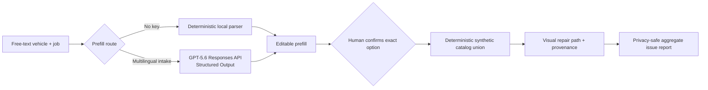

# Repair Intelligence Reference

A GPT-5.6-assisted, human-confirmed browser workflow for turning an incomplete
multilingual vehicle-service request into editable structured intake, a
transparent synthetic catalog union, and a visual repair path.

The repository is an original clean-room demonstrator. Every vehicle, source,
part, path, and issue is invented. It contains no production code, licensed
catalog content, customer records, pricing, deployment details, or private
product names.

## Try the complete deterministic path

Requirements: Node.js 20.6 or later. There are no runtime dependencies.

```bash
npm install
npm run check
npm start
```

Open [the local browser demo](http://localhost:4173). This reproducible fallback
needs no account, network access, or API key:

1. Parse the sample free-text request locally.
2. Review and edit every proposed field.
3. Open the deterministic synthetic catalog union.
4. Select one option and confirm it explicitly.
5. Inspect the visual node-to-part path and source provenance.
6. Submit a privacy-safe issue report and see the redacted aggregate receipt.

Front and rear brake service are both supported end to end, so the confirmed-path
logic is exercised across two independent synthetic jobs rather than one route.

The CLI remains available as a compact evidence path:

```bash
npm run demo
```

## Live GPT-5.6 multilingual prefill

GPT-5.6 owns one meaningful boundary: it converts multilingual, out-of-order,
colloquial intake into canonical editable fields. For the Czech synthetic sample
used in the demo, the local baseline extracts 3 of 7 fields; the live Structured
Output resolves the remaining engine, fuel, power, and transmission fields plus
the repair job. The browser displays that comparison together with the exact
served model returned by the API.

It still cannot choose a catalog record, confirm a vehicle, see source fixtures,
generate source data, or construct the deterministic repair path.

Keep the live credentials in a file outside the clone. For example, create
`/absolute/path/outside-this-repository/repair-intelligence.env` with
`OPENAI_API_KEY`, a new random `SAFETY_ID_SALT` of at least 16 characters, and
optionally `OPENAI_MODEL=gpt-5.6`. Restrict that file to its owner, then point
both live commands at it without copying or printing its contents:

```bash
export OPENAI_ENV_FILE=/absolute/path/outside-this-repository/repair-intelligence.env
npm run eval:ai
npm run start:ai
```

The launcher rejects relative paths and files inside the repository. This keeps
the publication and secret scans meaningful while both commands use the same
server-side configuration.

Configuration stays server-side. `OPENAI_MODEL` defaults to `gpt-5.6` and can be
changed without editing code. The live response must pass a semantic contract in
addition to the JSON Schema: fuel and transmission are canonical enums, numeric
fields are finite and range-checked, make/model are normalized, and application
code owns the supported job labels.

The request uses the [Responses API](https://developers.openai.com/api/docs/guides/migrate-to-responses),
strict Structured Outputs through `text.format`, `store: false`, low reasoning
effort, a short timeout, and one request with no retry. A random anonymous browser
session is HMAC-hashed on the server before it becomes the privacy-preserving
`safety_identifier` recommended in the [GPT-5.6 guidance](https://developers.openai.com/api/docs/guides/latest-model).

Vehicle identifiers, contact details, phone-like values, and token-like values
are rejected before either parser runs. Raw request text, model output, and issue
notes are never logged or persisted by this reference.

Before recording a live demo, run the synthetic multilingual eval through the
same external environment file:

```bash
npm run eval:ai
```

It makes three stateless synthetic requests and prints only pass/fail plus the
served model; raw request and response bodies are not logged.

## The product idea

Repair intake often begins as an incomplete sentence, while downstream catalog
selection requires exact identity and a reviewable decision. Collapsing those
steps into one opaque model response creates avoidable fitment and trust risk.

The cost is concrete: a misidentified vehicle can become a wrong part order, a
returned delivery, a repeat appointment, and lost workshop time, while leaving
no reviewable record of which source or assumption produced the mistake.

This reference uses a bounded division of labor:

- Language understanding proposes a structured prefill.
- A person checks the proposed fields and selects the exact option.
- Deterministic code merges synthetic sources and preserves distinct variants.
- A visual path explains which node and parts came from which source.
- Privacy-safe observability keeps only aggregate diagnostics for human triage.



## Why it matters

Independent workshops, parts counters, and fleet maintenance teams need language
understanding at intake without handing a generative model silent authority over
catalog identity. This reference makes that split visible: GPT-5.6 accelerates
intake, deterministic code owns identity and provenance, and an explicit human
decision separates a proposal from a consequence. The same boundary generalizes
to other workflows where free text meets an exact catalog.

## Safety invariants

- Natural language is always a proposal; it can never silently select a vehicle.
- The catalog union collapses records only when the full synthetic identity
  agrees. A distinct variant remains visible.
- Source priority picks the primary representation without erasing provenance.
- The server issues a short-lived, one-use review token bound to the exact fields,
  visible option IDs, repair job, and anonymous browser session. A direct or stale
  confirmation is rejected.
- Changing a reviewed field invalidates visible options and any confirmed path;
  late network responses cannot repaint stale state.
- The confirmed option and valid review token are the only inputs that can create
  a repair path.
- The model call is stateless (`store: false`) and has no browser-side key.
- Sensitive-looking input is rejected before any external request.
- Conflicting lower-priority source evidence is surfaced rather than silently
  overwriting the primary record.
- User issue notes are discarded; only stage, category, count, and a redacted
  fingerprint remain.
- Error aggregates cannot trigger code changes or automatic remediation.

## Repository map

| Path | Purpose |
| --- | --- |
| `public/` | Accessible four-stage browser interface |
| `src/server.js` | Minimal same-origin server and human-gated API |
| `src/openaiPrefill.js` | Responses API Structured Output and semantic contract |
| `src/vehiclePrefill.js` | Zero-network deterministic prefill |
| `src/catalogUnion.js` | Source precedence, deduplication, and variant preservation |
| `src/repairPath.js` | Synthetic visual node and parts path |
| `src/errorRollup.js` | Privacy-safe aggregate observability |
| `test/` | Offline unit, API, privacy, and contract tests |
| `scripts/` | Public-scope scanner, credential scanner, and live synthetic AI eval |
| `BUILD_WEEK.md` | Ready-to-customize competition submission copy |
| `docs/demo-video-storyboard.md` | Under-three-minute recording script |
| `PUBLIC_SCOPE.md` | Publication boundary and deliberate exclusions |

## Verification

```bash
npm run check
npm run demo
npm run check:public
npm run check:secrets
npm test
```

The CI workflow runs the same checks from a clean install. The public-scope scan
rejects infrastructure-shaped data, vehicle-identifier-shaped records, and
unapproved endpoints; the private prepublication run additionally rejects every
locally configured confidential label. The secret scan rejects common private-key,
access-key, token, and credential-assignment shapes.

These checks reduce publication risk; they do not replace a human review of the
final diff and repository history. Follow [RELEASE_CHECKLIST.md](RELEASE_CHECKLIST.md)
before publishing.

For the final private-name review, copy
`.private-public-scope-denylist.example.txt` to the ignored
`.private-public-scope-denylist.txt`, replace the examples with one confidential
literal per line, and rerun
`PUBLIC_SCOPE_REQUIRE_PRIVATE_DENYLIST=1 npm run check:public`. The populated
denylist must never be committed. Findings identify only a numbered private rule
and never echo its value.

To reuse an existing protected denylist without copying it into this checkout,
set `PUBLIC_SCOPE_PRIVATE_DENYLIST_PATH` to its absolute local path together with
`PUBLIC_SCOPE_REQUIRE_PRIVATE_DENYLIST=1`.

## Built during the Submission Period

This clean-room synthetic reference app was built on **18–19 Jul 2026** during
the Submission Period. It was newly written for the entry and contains no production
source, licensed catalog data, real customer data, or production-derived assets.

## OpenAI Build Week submission status

- **Track:** Work and Productivity
- **GPT-5.6 usage:** GPT-5.6 performs the multilingual structured-intake step,
  where the live demo measures its contribution against the same deterministic
  baseline. The zero-key path remains available only for reproducibility.

### How I collaborated with Codex

Codex accelerated the implementation loop, but did not make the product or
fitment decisions. I used it to turn the bounded architecture into the browser
workflow and server, generate adversarial privacy and confirmation tests, review
the Responses API boundary, build the two-job synthetic fixtures, and create
publication scanners that fail when private-looking material or credential
shapes enter the repository. I kept every suggested change only after the same
clean install and offline gate passed.

The key product decisions stayed explicit and human-owned:

- GPT-5.6 may propose an editable language prefill, but it cannot select a
  vehicle, see source fixtures, or construct the repair path.
- Exact identity, deduplication, variant preservation, precedence, and
  provenance remain deterministic code.
- The user must choose one visible option and confirm it before a path exists.
- Raw issue notes are discarded; aggregates cannot trigger automatic fixes.
- The entry is a newly written clean-room reference, not a publication of a
  pre-existing private product or licensed data.

Codex was especially useful in three review loops. First, it traced an
inconsistent post-confirmation state and led to revision guards that discard late
responses after a user edit. Second, it caught that prompt-only multilingual
canonicalization could accept a localized fuel token and then return zero catalog
matches; the fix moved canonical enums and numeric ranges into both schema and
application validation. Third, it turned those failures into regression tests and
expanded both publication scanners to cover scripts and environment files.
GPT-5.6 contributes at the ambiguous-language boundary; Codex contributed across
implementation, review, testing, safety hardening, and submission packaging.

Submission-only values are deliberately not invented or committed here:

- **Repository URL:** `https://github.com/pineyaaard/repair-intelligence-reference`
- **Demo video URL:** Supplied directly in the Devpost submission after the final
  recording is reviewed.
- **/feedback Session ID:** Supplied directly in the Devpost submission from the
  final `/feedback` response.
- **Entrant identity:** Supplied directly in the Devpost submission.

## Important boundary

This project demonstrates workflow mechanics, not real fitment. It is not a
repair manual, catalog, estimator, diagnostic tool, or parts recommendation.
See [SECURITY.md](SECURITY.md), [PUBLIC_SCOPE.md](PUBLIC_SCOPE.md), and the
[proprietary evaluation license](LICENSE). All original material is provided
for contest evaluation only; no general-use, copying, derivative-work, AI
training, or commercial license is granted.
