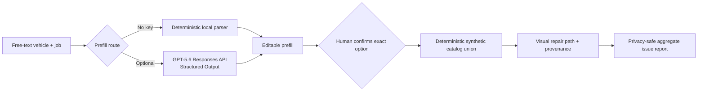

# Repair Intelligence Reference

A privacy-first, human-confirmed browser workflow for turning an incomplete
vehicle-service request into a transparent synthetic catalog union and visual
repair path.

The repository is an original clean-room demonstrator. Every vehicle, source,
part, path, and issue is invented. It contains no production code, licensed
catalog content, customer records, pricing, deployment details, or private
product names.

## Try the complete demo

Requirements: Node.js 20.6 or later. There are no runtime dependencies.

```bash
npm install
npm run check
npm start
```

Open [the local browser demo](http://localhost:4173). The default path needs no
account, network access, or API key:

1. Parse the sample free-text request locally.
2. Review and edit every proposed field.
3. Open the deterministic synthetic catalog union.
4. Select one option and confirm it explicitly.
5. Inspect the visual node-to-part path and source provenance.
6. Submit a privacy-safe issue report and see the redacted aggregate receipt.

The CLI remains available as a compact evidence path:

```bash
npm run demo
```

## Optional GPT-5.6 prefill

GPT-5.6 can replace only the first parsing step. It does not choose a catalog
record, confirm a vehicle, generate source data, or alter the deterministic
repair path.

```bash
cp .env.example .env
# Add OPENAI_API_KEY and a new random SAFETY_ID_SALT to .env.
npm run start:ai
```

Configuration stays server-side. The browser receives only an availability flag
and the configured model label. `OPENAI_MODEL` defaults to `gpt-5.6` and can be
changed without editing code.

The optional request uses the [Responses API](https://developers.openai.com/api/docs/guides/migrate-to-responses),
strict Structured Outputs through `text.format`, `store: false`, low reasoning
effort, a short timeout, and one request with no retry. A random anonymous browser
session is HMAC-hashed on the server before it becomes the privacy-preserving
`safety_identifier` recommended in the [GPT-5.6 guidance](https://developers.openai.com/api/docs/guides/latest-model).

Vehicle identifiers, contact details, phone-like values, and token-like values
are rejected before either parser runs. Raw request text, model output, and issue
notes are never logged or persisted by this reference.

## The product idea

Repair intake often begins as an incomplete sentence, while downstream catalog
selection requires exact identity and a reviewable decision. Collapsing those
steps into one opaque model response creates avoidable fitment and trust risk.

This reference uses a bounded division of labor:

- Language understanding proposes a structured prefill.
- A person checks the proposed fields and selects the exact option.
- Deterministic code merges synthetic sources and preserves distinct variants.
- A visual path explains which node and parts came from which source.
- Privacy-safe observability keeps only aggregate diagnostics for human triage.



## Safety invariants

- Natural language is always a proposal; it can never silently select a vehicle.
- The catalog union collapses records only when the full synthetic identity
  agrees. A distinct variant remains visible.
- Source priority picks the primary representation without erasing provenance.
- The confirmed option is the only input that can create a repair path.
- The optional model call is stateless (`store: false`) and has no browser-side key.
- Sensitive-looking input is rejected before any optional external request.
- User issue notes are discarded; only stage, category, count, and a redacted
  fingerprint remain.
- Error aggregates cannot trigger code changes or automatic remediation.

## Repository map

| Path | Purpose |
| --- | --- |
| `public/` | Accessible four-stage browser interface |
| `src/server.js` | Minimal same-origin server and human-gated API |
| `src/openaiPrefill.js` | Optional Responses API Structured Output adapter |
| `src/vehiclePrefill.js` | Zero-network deterministic prefill |
| `src/catalogUnion.js` | Source precedence, deduplication, and variant preservation |
| `src/repairPath.js` | Synthetic visual node and parts path |
| `src/errorRollup.js` | Privacy-safe aggregate observability |
| `test/` | Offline unit, API, privacy, and contract tests |
| `scripts/` | Public-scope and credential-shape scanners |
| `BUILD_WEEK.md` | Ready-to-customize competition submission copy |
| `docs/demo-video-storyboard.md` | Under-three-minute recording script |
| `PUBLIC_SCOPE.md` | Publication boundary and deliberate exclusions |

## Verification

```bash
npm run check:public
npm run check:secrets
npm test
```

The CI workflow runs the same checks from a clean install. The public-scope scan
rejects infrastructure-shaped data, vehicle-identifier-shaped records, and
unapproved endpoints; the private prepublication run additionally rejects every
locally configured confidential label. The secret scan rejects common private-key,
access-key, token, and credential-assignment shapes.

These checks reduce publication risk; they do not replace a human review of the
final diff and repository history. Follow [RELEASE_CHECKLIST.md](RELEASE_CHECKLIST.md)
before publishing.

For the final private-name review, copy
`.private-public-scope-denylist.example.txt` to the ignored
`.private-public-scope-denylist.txt`, replace the examples with one confidential
literal per line, and rerun
`PUBLIC_SCOPE_REQUIRE_PRIVATE_DENYLIST=1 npm run check:public`. The populated
denylist must never be committed. Findings identify only a numbered private rule
and never echo its value.

## Built during the Submission Period

This clean-room synthetic reference app was built on **18 Jul 2026** during the
Submission Period. It was newly written for the entry and contains no production
source, licensed catalog data, real customer data, or production-derived assets.

## OpenAI Build Week submission status

- **Track:** Work and Productivity
- **GPT-5.6 usage:** When the optional server-side path is enabled, GPT-5.6
  performs only the strict structured prefill described above. The zero-key
  workflow remains the reproducible default.

### How I collaborated with Codex

Codex accelerated the implementation loop, but did not make the product or
fitment decisions. I used it to turn the bounded architecture into the browser
workflow and server, generate adversarial privacy and confirmation tests, review
the API boundary, and create publication scanners that fail when private-looking
material or credential shapes enter the repository. I kept every suggested
change only after the same clean install and offline gate passed.

The key product decisions stayed explicit and human-owned:

- GPT-5.6 may propose an editable language prefill, but it cannot select a
  vehicle, see source fixtures, or construct the repair path.
- Exact identity, deduplication, variant preservation, precedence, and
  provenance remain deterministic code.
- The user must choose one visible option and confirm it before a path exists.
- Raw issue notes are discarded; aggregates cannot trigger automatic fixes.
- The entry is a newly written clean-room reference, not a publication of a
  pre-existing private product or licensed data.

Codex was especially useful when browser verification exposed an inconsistent
post-confirmation status: it helped trace the UI state boundary, add the missing
state update, and preserve that correction with a regression assertion. GPT-5.6
contributes only at the ambiguous-language boundary; Codex contributed across
implementation, review, testing, safety hardening, and submission packaging.

Submission-only values are deliberately not invented or committed here:

- **Repository URL:** `https://github.com/pineyaaard/repair-intelligence-reference`
- **Demo video URL:** Supplied directly in the Devpost submission after the final
  recording is reviewed.
- **/feedback Session ID:** Supplied directly in the Devpost submission from the
  final `/feedback` response.
- **Entrant identity:** Supplied directly in the Devpost submission.

## Important boundary

This project demonstrates workflow mechanics, not real fitment. It is not a
repair manual, catalog, estimator, diagnostic tool, or parts recommendation.
See [SECURITY.md](SECURITY.md), [PUBLIC_SCOPE.md](PUBLIC_SCOPE.md), and the
[proprietary evaluation license](LICENSE). All original material is provided
for contest evaluation only; no general-use, copying, derivative-work, AI
training, or commercial license is granted.
